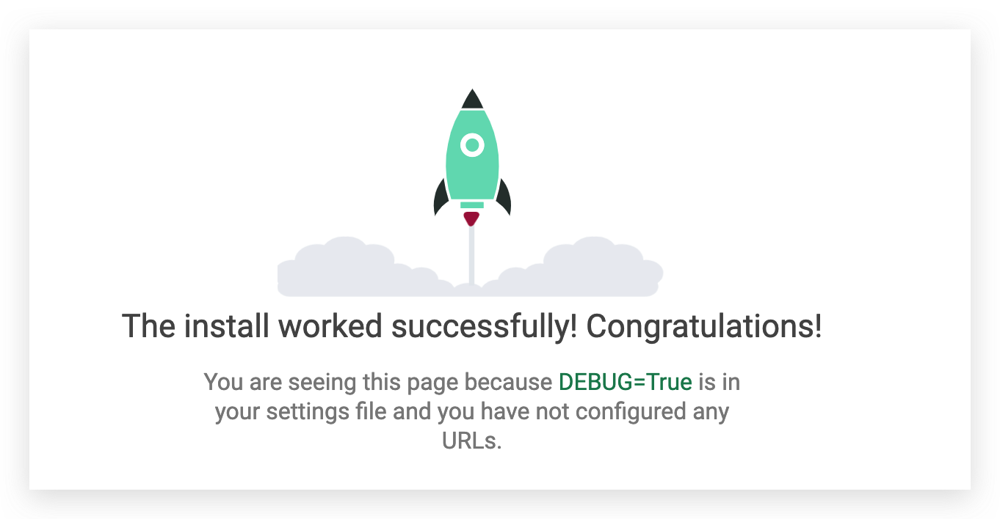

# twitter-commentComponent

# Use `bash my-provision.sh` to build env

Each time, Pull Requests -> new pull request to compare repos

> `git add .` and `git commit` then git reset is OK.
>
> After push, remote ask for a pull request :)
>
> Merge request (TO main), and pull request would be closed

之前没有过多尝试 pull request 内的功能

<br>

# Build Django Proj

```bash
(twit) MacBook-Pro:twitter_backend_explore_proj_one gsq$ git pull origin main
remote: Enumerating objects: 2, done.
remote: Counting objects: 100% (2/2), done.
remote: Compressing objects: 100% (2/2), done.
remote: Total 2 (delta 0), reused 0 (delta 0), pack-reused 0
Unpacking objects: 100% (2/2), 1.20 KiB | 1.20 MiB/s, done.
From https://github.com/Guo-lab/twitter_backend_explore_proj_one
 * branch            main       -> FETCH_HEAD
   cc27ebf..8936ebb  main       -> origin/main
Updating cc27ebf..8936ebb
Fast-forward
 .gitignore                             | 139 ++++++++++++++++++++++++++++++++++++++++++++++++++++++++
 default-assets-from-tutor/provision.sh |  62 +++++++++++++++++++++++++
 my-provision.sh                        |  43 ++++++++++++++++++
 notes.md                               |  14 ++++++
 requirements.txt                       |   2 +
 5 files changed, 260 insertions(+)
 create mode 100644 .gitignore
 create mode 100644 default-assets-from-tutor/provision.sh
 create mode 100644 my-provision.sh
 create mode 100644 notes.md
 create mode 100644 requirements.txt
```

- `django-admin.py startproject twitter`
- 可以将 manage.py 和 twitter 放入到项目根目录下
- `python manage.py` check
- 修改 settings DATABASES, ALLOWED_HOSTS

  - `mysql -u root -p` and
  - `show global variables like 'port';`
    <br>
- (预之前操作类似，将/usr/local/mysql/lib/* 全部复制到 /Applications/anaconda3/envs/twit/lib
  内) [Solution](https://stackoverflow.com/questions/63109987/nameerror-name-mysql-is-not-defined-after-setting-change-to-mysql)
- Problem: django.db.utils.OperationalError: (2003, "Can't connect to MySQL server on '0.0.0.0' (61)") ----> DATABASES 错误
- `python manage.py migrate`
- `python manage.py runserver 127.0.0.1:3036`

  

<br>

# Superserver

1. `python manage.py createsuperuser`
2. `python manage.py startapp accounts` 新建一个 service, 以后后台可通过 IP:PORT/admin 访问到
3. 需要安装新的库 `pip install djangorestframework`
4. 以下：[Home - Django REST framework Official Document](https://www.django-rest-framework.org/)
   <br>
   - settings.py:   FRAMEWORK设定了翻页配置，
   - urls.py:       路由
   - views.py:      规定了视图，也有检测的作用
   - serializer.py: 数据渲染(组织)的方式, 比如返回什么样的数据
